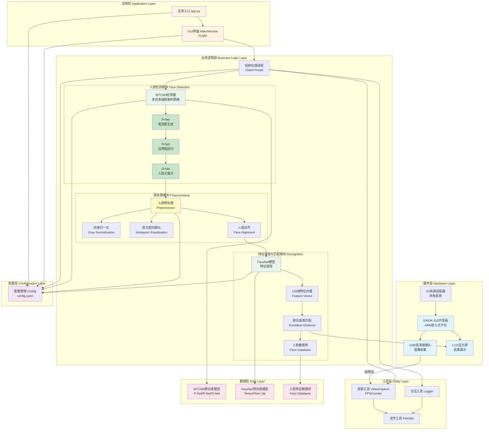
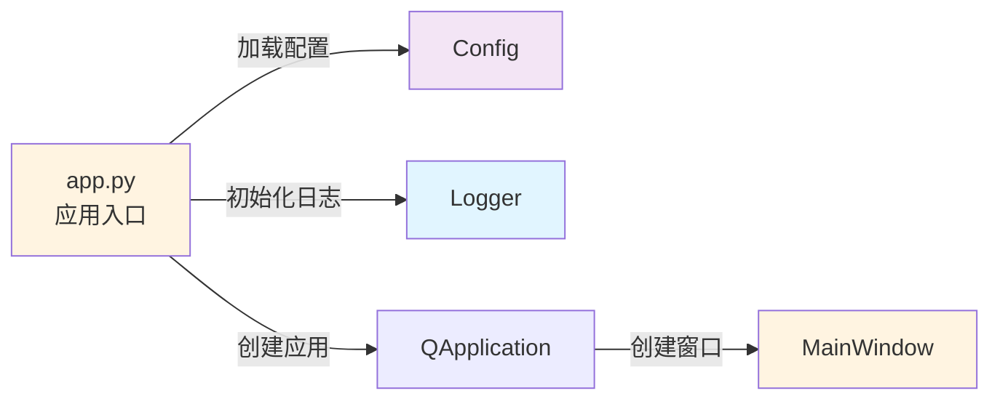
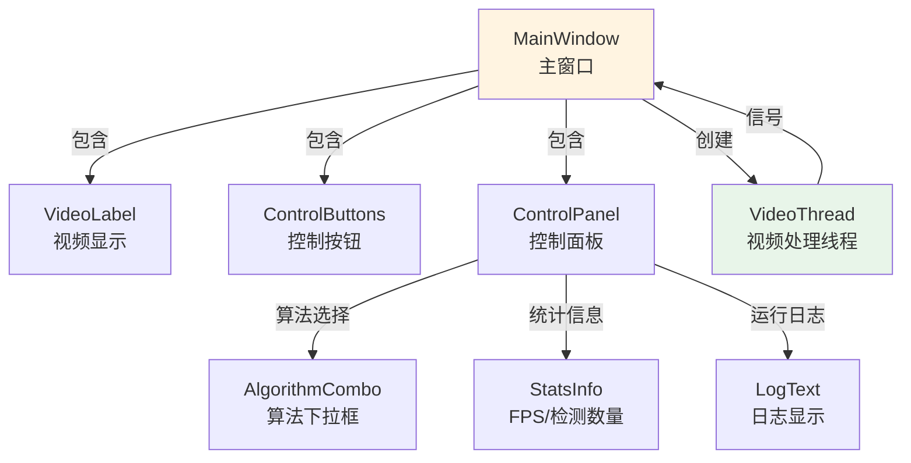
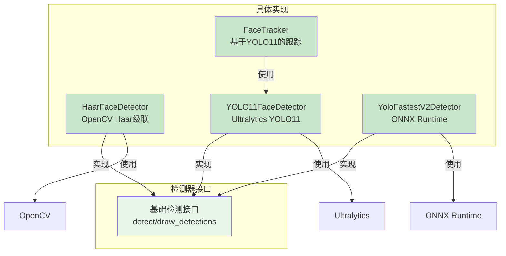
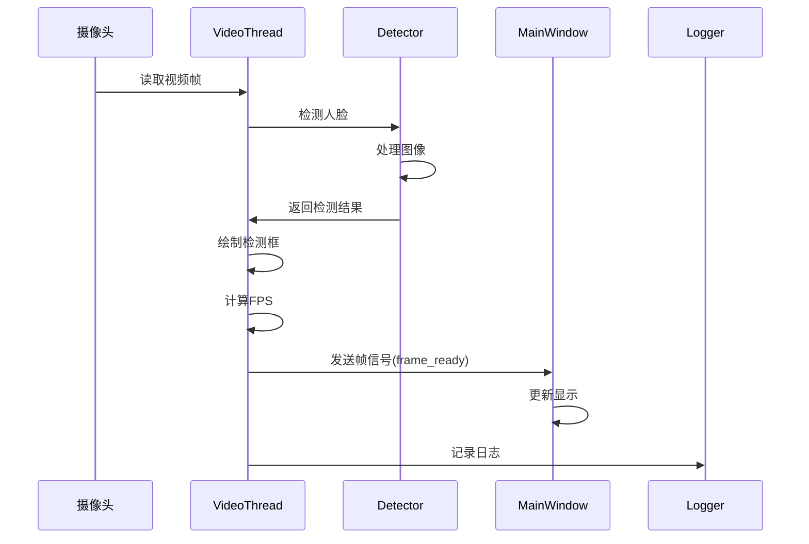

# 系统架构图

## 项目信息

**项目名称**: 基于EAIDK-310的人脸识别系统设计与实现  
**学院**: 人工智能学院、自动化学院  
**班级**: 智能2304  
**组长**: 高佳愿（23063122）  
**小组成员**: 张旭阳（23063120）、田雨稼（23063130）  
**时间**: 2025年12月1日-2025年12月12日

## 整体架构



## 模块详细架构

### 1. 应用入口层



### 2. GUI层架构



### 3. 检测器模块架构



### 4. 数据流架构



## 技术栈

### 前端/界面
- **PyQt5**: GUI框架
- **QThread**: 多线程处理
- **OpenCV**: 图像处理和显示

### 检测算法
- **OpenCV Haar Cascade**: 传统机器学习方法
- **YOLO11 (Ultralytics)**: 深度学习目标检测
- **Yolo-FastestV2 (ONNX)**: 轻量级快速检测
- **Face Tracking**: 基于YOLO11的人脸跟踪

### 工具库
- **OpenCV (cv2)**: 计算机视觉库
- **NumPy**: 数值计算
- **PyYAML**: 配置文件解析
- **logging**: 日志系统

### 硬件平台
- **EAIDK-310**: ARM开发板
- **USB摄像头**: 视频输入设备

## 目录结构映射

```
yoloface/
├── src/yoloface/
│   ├── app.py                    → 应用入口层
│   ├── gui/
│   │   └── main_window.py        → GUI层
│   ├── detectors/                → 业务逻辑层
│   │   ├── haar_detector.py
│   │   ├── yolo11_detector.py
│   │   ├── fastestv2_detector.py
│   │   └── face_tracker.py
│   ├── utils/                    → 工具层
│   │   ├── video.py
│   │   ├── logger.py
│   │   └── file_utils.py
│   └── config/                   → 配置层
│       └── config.py
├── models/                       → 数据层
│   └── yolo11n.pt
├── haarcascades/                 → 数据层
│   └── *.xml
└── config.yaml                   → 配置层
```

## 关键设计模式

### 1. 策略模式 (Strategy Pattern)
- **应用**: 多种检测算法的切换
- **实现**: 通过 `change_detector()` 方法动态切换检测器

### 2. 观察者模式 (Observer Pattern)
- **应用**: GUI更新视频帧
- **实现**: PyQt5的信号槽机制 (`frame_ready` 信号)

### 3. 单例模式 (Singleton Pattern)
- **应用**: 配置管理
- **实现**: `load_config()` 函数返回全局唯一配置实例

### 4. 工厂模式 (Factory Pattern)
- **应用**: 检测器创建
- **实现**: `init_detector()` 方法根据类型创建对应检测器

## 性能优化

1. **多线程处理**: 视频处理在独立线程中运行，避免阻塞GUI
2. **FPS控制**: 通过 `msleep(33)` 控制帧率约30 FPS
3. **资源管理**: 使用上下文管理器 (`with` 语句) 管理摄像头资源
4. **配置缓存**: 配置单例模式避免重复加载

## 扩展性

### 添加新检测器
1. 在 `detectors/` 目录创建新检测器类
2. 实现 `detect()` 和 `draw_detections()` 方法
3. 在 `detectors/__init__.py` 中导出
4. 在GUI中添加选项

### 添加新功能
1. 在 `utils/` 目录添加工具函数
2. 在相应模块中导入使用
3. 更新配置文件（如需要）

## 系统特性

- ✅ **模块化设计**: 各模块职责清晰，易于维护
- ✅ **配置驱动**: 通过YAML配置文件管理所有参数
- ✅ **日志系统**: 完整的日志记录和输出
- ✅ **多算法支持**: 支持三种检测算法和跟踪功能
- ✅ **实时处理**: 多线程架构保证实时性能
- ✅ **用户友好**: 直观的GUI界面和操作体验

