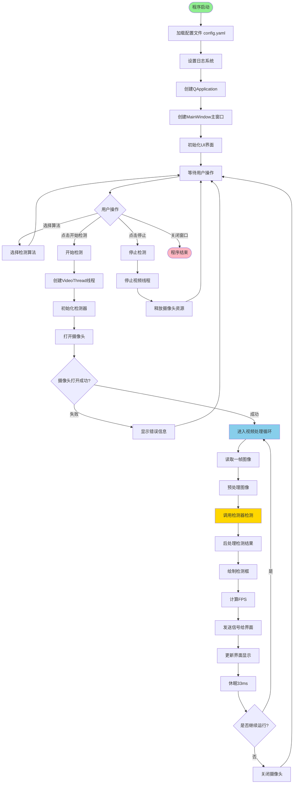
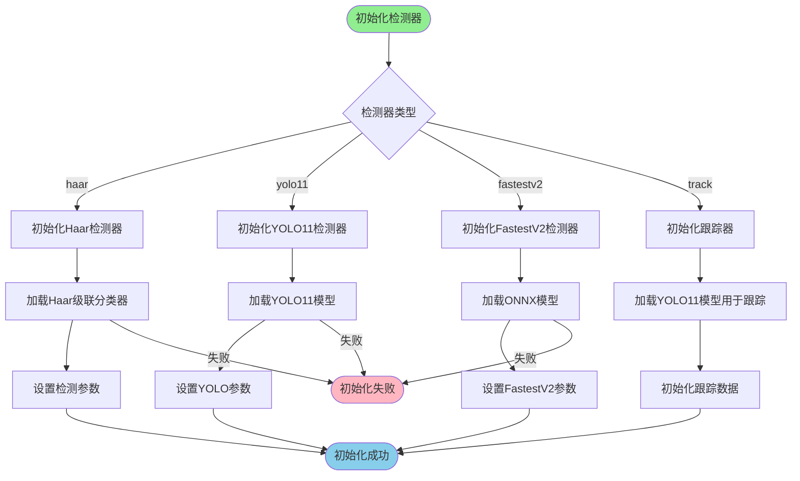
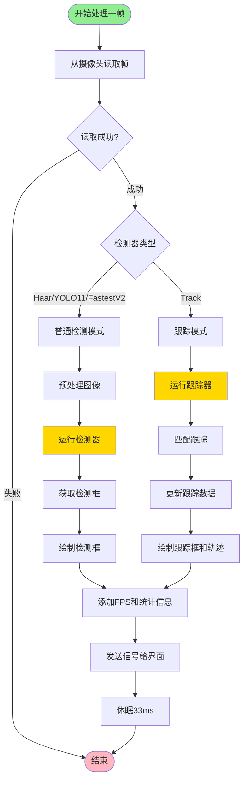
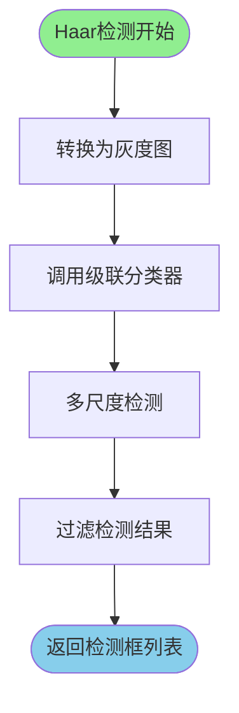
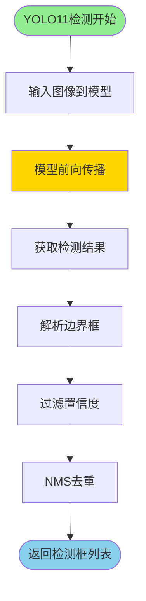
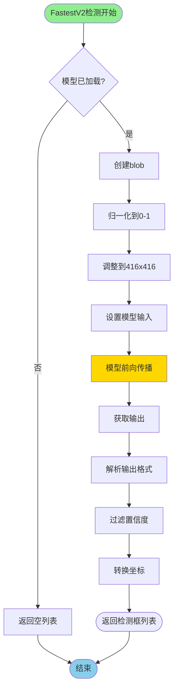
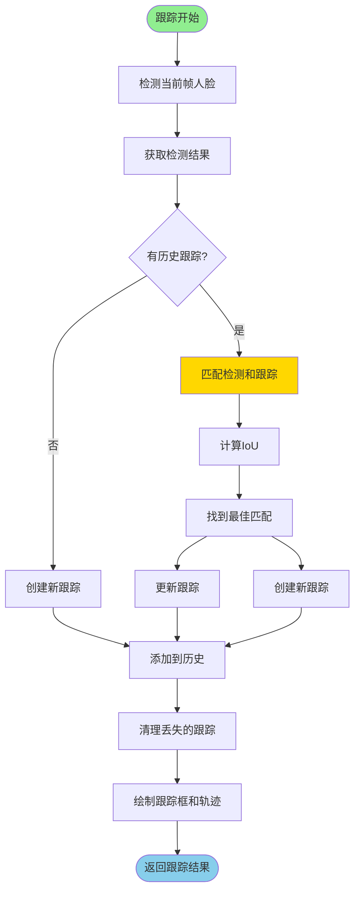
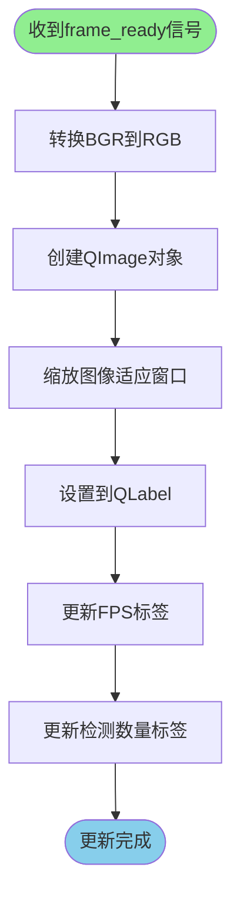
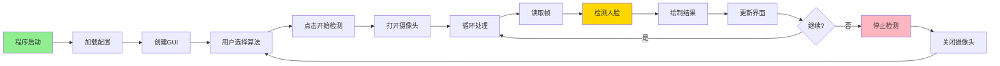
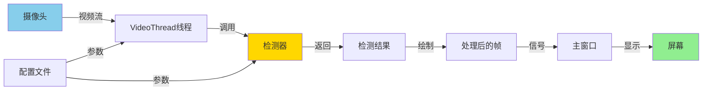

# 项目流程图

## 一、整体流程图

## 二、检测器初始化流程图

## 三、单帧检测流程图

## 四、Haar检测器详细流程

## 五、YOLO11检测器详细流程

## 六、FastestV2检测器详细流程

## 七、人脸跟踪流程图

## 八、界面更新流程图

## 九、完整系统流程图（简化版）

## 十、数据流图

## 流程图说明

### 关键节点说明

1. **程序启动**：`app.py` 的 `main()` 函数
2. **配置加载**：从 `config.yaml` 读取配置
3. **检测器初始化**：根据选择的算法创建对应的检测器
4. **视频循环**：核心处理循环，每秒处理约30帧
5. **检测执行**：调用检测器进行人脸检测
6. **界面更新**：通过信号槽机制更新GUI

### 关键决策点

- **检测器类型选择**：决定使用哪种算法
- **摄像头状态**：检查摄像头是否成功打开
- **运行状态**：决定是否继续处理视频帧
- **匹配跟踪**：跟踪模式下的IoU匹配

### 性能优化点

- **多线程**：视频处理在独立线程，不阻塞GUI
- **FPS控制**：每帧休眠33ms，控制处理速度
- **信号槽机制**：异步更新界面，提高响应性

## 使用说明

这些流程图展示了项目从启动到检测的完整过程，包括：

1. **整体流程**：程序启动到结束的完整流程
2. **检测器初始化**：不同检测器的初始化过程
3. **单帧处理**：每一帧图像的处理流程
4. **各检测器详细流程**：Haar、YOLO11、FastestV2的具体实现
5. **跟踪流程**：人脸跟踪的完整过程
6. **界面更新**：GUI更新的流程
7. **数据流**：数据在系统中的流动

可以通过这些流程图快速理解项目的整体架构和执行逻辑。

